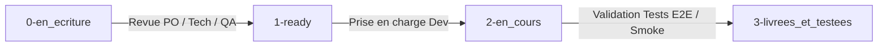

# 📋 Système de Backlog & Gestion des User Stories (US) — Projet Partoches

Ce dossier centralise le backlog du projet **Partoches**. Il est conçu pour être facilement lisible et manipulable aussi bien par des **développeurs humains** que par des **agents IA (Antigravity/Gemini)**.

---

## 🗺️ 1. Architecture des Dossiers

```
documentation/backlog/
├── README.md                          → Protocole de fonctionnement & gouvernance
├── 0-en_ecriture/                     → US en cours de rédaction / idéation
├── 1-ready/                           → US validées (PO, Tech Lead, QA, Dev) & prêtes pour sprint
├── 2-en_cours/                        → US en cours de développement & de tests
└── 3-livrees_et_testees/              → US livrées, testées et archivées
```

---

## 🔄 2. Workflow & Cycle de Vie d'une User Story



### Étape 1 : `0-en_ecriture` (Rédaction)
- **Objectif** : Exprimer le besoin sous forme de User Story.
- **Acteurs** : Product Owner (PO), Chef de Projet, ou tout membre proposant une évolution.
- **Livrable** : Un fichier `.md` nommé `US-XXX_Titre_Court.md` utilisant le template standard.

### Étape 2 : `1-ready` (Prêt pour Dev - DoR)
- **Objectif** : Valider que la US est claire, estimée et techniquement faisable.
- **Conditions (Definition of Ready - DoR)** :
  - [x] Enoncé clair : *"En tant que... Je veux... Afin de..."*
  - [x] Critères d'acceptation rédigés (format Gherkin Given/When/Then).
  - [x] Impacts architecturaux et sécurité identifiés par le Tech Lead.
  - [x] Stratégie de test définie par l'Ingénieur Test (Unitaires, Smoke, E2E Cypress).
  - [x] Validé par les 6 profils (PO, SM, PM, Tech Lead, QA, Dev).

### Étape 3 : `2-en_cours` (Développement & Tests)
- **Objectif** : Implémenter la fonctionnalité et écrire les tests correspondants.
- **Suivi** : Mettre à jour la checklist des tâches dans le fichier de la US.
- **Règles de Code** : Suivre les principes SOLID, le Design System Canopée et zéro style inline (voir `GEMINI.MD`).

### Étape 4 : `3-livrees_et_testees` (Archivage - DoD)
- **Objectif** : Confirmer la livraison en production/local et l'exécution réussie des tests.
- **Conditions (Definition of Done - DoD)** :
  - [x] Code conforme aux standards du projet (Linter HTML OK, pas d'erreurs PHP).
  - [x] Tests unitaires PHPUnit et smoke tests OK.
  - [x] Tests E2E Cypress exécutés et validés sans régression.
  - [x] Documentation fonctionnelle et `gemini-log.md` mis à jour.
  - [x] Déplacé dans `3-livrees_et_testees/`.

---

## 👥 3. Rôles et Responsabilités dans la Revue (Gouvernance)

| Profil | Responsabilité dans le Backlog |
| :--- | :--- |
| **Product Owner (PO)** | Exprime la valeur métier, rédige les critères d'acceptation, valide la priorité. |
| **Chef de Projet (PM)** | Aligne le backlog avec la feuille de route globale et les échéances. |
| **Scrum Master (SM)** | S'assure de la fluidité des transitions d'étapes et lève les blocages. |
| **Tech Lead** | Valide l'architecture (SOLID, PDO, Canopée), les impacts BDD et la faisabilité. |
| **Ingénieur Test (QA)** | Définit le plan de test (PHPUnit, Smoke, Cypress E2E) et contrôle la DoD. |
| **Développeur (Dev)** | Estime l'effort, découpe les tâches techniques et réalise l'implémentation. |

---

## 📝 4. Format Standard d'une US (`template-us.md`)

Chaque fichier US doit suivre la structure suivante :

```markdown
# US-XXX : [Titre de la Feature]

**Statut** : `[0-en_ecriture | 1-ready | 2-en_cours | 3-livrees_et_testees]`  
**Priorité** : `[Haute | Moyenne | Basse]`  
**Auteur** : `[Nom / Agent]`  

## 🎯 Énoncé Métier
En tant que **[Type d'utilisateur]**,  
Je veux **[Action / Fonctionnalité]**,  
Afin de **[Bénéfice / Valeur produite]**.

## 📋 Critères d'Acceptation (Gherkin)
```gherkin
Scénario: [Nom du scénario]
  Étant donné [Contexte]
  Quand [Action]
  Alors [Résultat attendu]
```

## 🏗️ Impact Technique & Architecture
- **Composants PHP** : `Controller`, `Service`, `View` (SOLID)
- **Impact BDD** : Migration SQL nécessaire ? `Oui/Non`
- **Design** : Composants Canopée utilisés

## 🧪 Stratégie de Test
- [ ] Tests Unitaires PHPUnit
- [ ] Smoke Tests (SongbookSmokeTest)
- [ ] Tests E2E Cypress

## 🛠️ Checklist des Tâches Techniques
- [ ] Tâche 1
- [ ] Tâche 2
```
